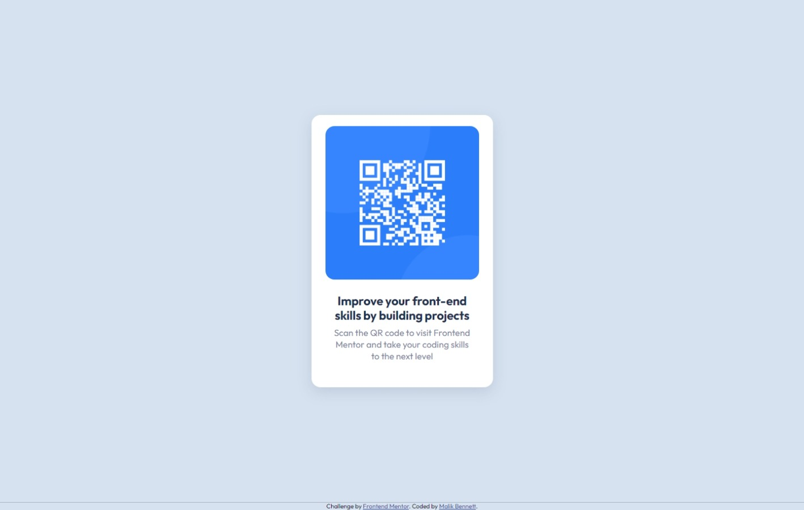

# Frontend Mentor - QR code component solution

This is a solution to the [QR code component challenge on Frontend Mentor](https://www.frontendmentor.io/challenges/qr-code-component-iux_sIO_H). Frontend Mentor challenges help you improve your coding skills by building realistic projects.

## Overview

### Screenshot

## Desktop View

## Mobile View

### Links

- Solution: [https://www.frontendmentor.io/solutions/qr-code-component-oPngYIsNwt](https://www.frontendmentor.io/solutions/qr-code-component-oPngYIsNwt)
- Live Site: [https://rebrodie.github.io/QR-Code-Component/](https://rebrodie.github.io/QR-Code-Component/)
- Process: [https://www.youtube.com/watch?v=6r028goKeb4&t](https://www.youtube.com/watch?v=6r028goKeb4&t)

## Follow Me

- Youtube - [@RebrodieCode](https://www.youtube.com/channel/UCV3pxcx9ALp99txTD6KF3Wg)
- Twitter - [@Rebrodiecode](https://twitter.com/rebrodiecode)
- Frontend Mentor - [@Rebrodie](https://www.frontendmentor.io/profile/Rebrodie)
